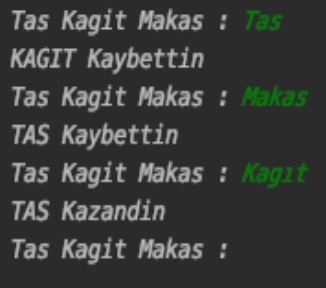
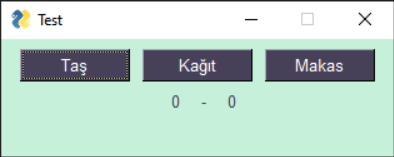
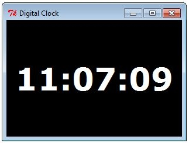
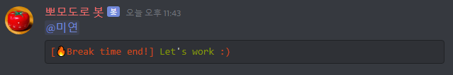
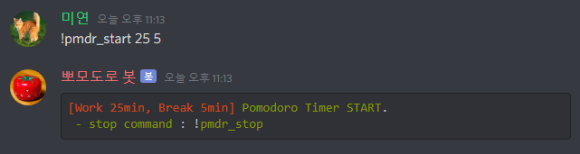
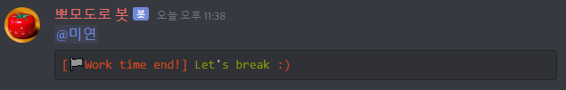

# Projeler

Öğrenme sürecinizin son aşaması olan projelere hoş geldiniz. Sizden isteğimiz aşağıda belirtilen 3 projeden birini seçip ekipçe üzerine kafa yorarak geliştirmeniz. 

## Taş Kağıt Makas

Bilgisayara karşı çalışan bir Taş, Kağıt, Makas oyunu. Bu projede **random** kütüphanesini kullanmanızı tavsiye ediyoruz.

#### Konsol Versiyonu

#### Arayüz(PySimpleGUI) Versiyonu

Bir arayüz oluşturmak sizi daha çok geliştirecektir. Python dili ile kullanılabilen **PySimpleGUI** kütüphanesi sayesinde arayüz tasarımı yapabilirsiniz.

## Python ile Saat Uygulaması // It’s CodeCraft o’clock!

Saati gösteren bir program yazmaya ne dersiniz? Bu projede **PySimpleGUI** ve **time** kütüphanelerinden yararlanmalısınız. 

## Sihirli Discord Botu

Bu projede sizden belirlediğiniz bir zaman aralığı kadar geri sayım yapıp, çalar saat görevi gören bir Discord botu yazmanız. Örnek olarak, botunuzun süresini 40 dakika olarak ayarlarsanız, başlatıldığı saatten 40 dakika sonrasında sizi mesajla uyarmalı. Projeyi yaparken **discord.py** kütüphanesinden yararlanmalısınız.

## -[Form Linki][formlink]
- https://forms.gle/uxmQhRN851E4NXnW6
[formlink]: https://forms.gle/uxmQhRN851E4NXnW6
